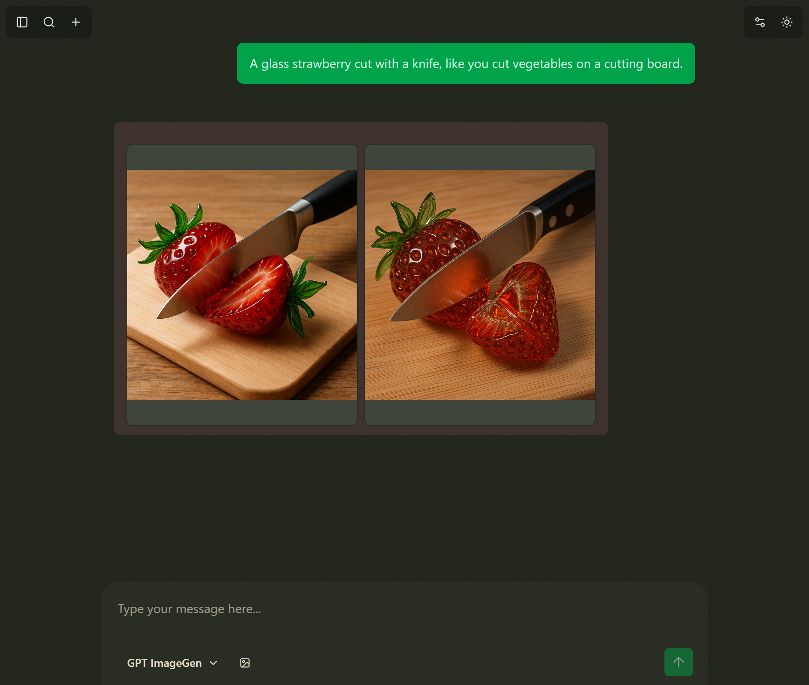
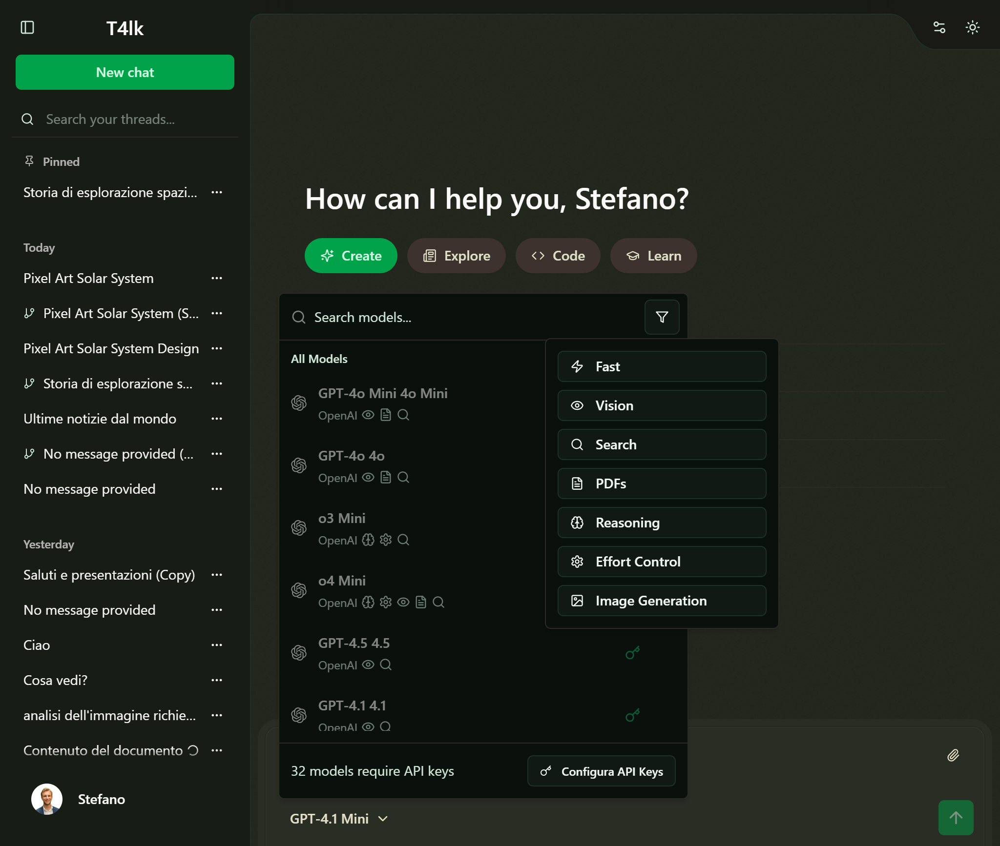

# T4lk Chat – T3 ChatCloneathon Submission

Welcome to **T4lk Chat**, my entry for the [T3 Chat Cloneathon](https://cloneathon.t3.chat/)!

---

## 🚀 About the Project

T4lk Chat is an AI chat app built for the T3 Chat Cloneathon. The focus was on delivering a functional, browser-friendly, and open-source chat experience with support for multiple LLMs, authentication, and chat history sync. The codebase is a true hackathon effort: it works, but it could use a lot of love, refactoring, and cleanup. Enjoy the vibes!

> ⚡ **Note:** This project was created in a very short time for the challenge. The code is not production-ready and would benefit from a full refactor and cleanup. Expect some rough edges!


---

## 🏆 Challenge Requirements & Features

### ✅ Core Requirements (All Met)

- **Chat with Various LLMs:**
  - Supports multiple language models/providers (see settings)
- **Authentication & Sync:**
  - User authentication with chat history synced per user
  - Anonymous mode available
- **Browser Friendly:**
  - 100% web-based, no native app required
- **Easy to Try:**
  - Just clone, install, and run! (see below)

### ✨ Bonus Features Implemented

- **Attachment Support:**
  - Upload images and PDFs to chats
- **Image Generation Support:**
  - Generate images using gpt-image-1
- **Syntax Highlighting:**
  - Beautiful code formatting in chat messages
- **Chat branching:**
  - Create alternative conversation paths
- **Chat Sharing:**
  - Share conversations with others with a public link
- **Web Search:**
  - Perform web searches directly from the chat (with supported LLMs)
- **Bring Your Own Key:**
  - Use your own API keys (OpenRouter supported)
  - If you want you can set your api keys in the `.env` file and use the models without needing to set them in the UI (see `.env.example` for reference)
- **Multi provider Support:**
  - Supports multiple LLM providers (OpenAI, Ollama, etc.)
- **Multi Authentication providers:**
  - Supports multiple authentication thanks to [BetterAuth](https://github.com/better-auth/better-auth) - Only Github implemented for now
- **Multiple Languages:**
  - UI available in multiple languages (Currently English and Italian)
- **Customizable user preferences and informations like T3 Chat:**
  - Change how the LLMs know you, your name, your caracteristics, and more

---

## 🏗️ How to Run

### Prerequisites

- Node.js (v20 or higher)
- npm or any compatible package manager (pnpm, yarn, bun etc.)

### Installation & Setup

1. **Clone the repository:**

   ```bash
   git clone <your-repo-url>
   cd project
   ```

2. **Install dependencies:**

   ```bash
   npm install
   # or
   bun install
   ```

3. **Set up environment variables:**

   - Copy the `.env.example` file to `.env` and update it with your API keys and settings.

   ```bash
   cp .env.example .env
   ```

   - If you want to make models available to all users with your api keys, you can set them in the `.env` file.
   - Actually the "title generation" feature requires a dedicated openrouter API, which you can set in the `.env` file or it will use the user api key if available or the default one (if provided in the `.env` file).

4. **Start the development server:**

   ```bash
   npm run dev
   # or
   bun dev
   ```

5. **Open in your browser:**
   - Navigate to `http://localhost:3000`
   - Enjoy chatting!

---

## 🛠️ Tech Stack

- **Framework:** [Nuxt 3](https://nuxt.com)
- **Database:** SQLite with [Drizzle ORM](https://github.com/drizzle-team/drizzle-orm)
- **Authentication:** [BetterAuth](https://github.com/better-auth/better-auth)
- **Styling:** Tailwind CSS and [shadcn-vue](https://github.com/unovue/shadcn-vue)
- **AI Integration:** Multiple LLM providers support (OpenAI, OpenRouter, Anthropic, etc.)
- **File Uploads:** Built-in attachment system using nuxt [server storage](https://nuxt.com/docs/guide/directory-structure/server#server-storage) - currentrly save images in filesystem but is configurable to use S3 or other storage solutions

---

## 📝 Notes & Disclaimers

- This project was built in a **very short time** for the hackathon, as I could only work on it in my extra/free time
- The code is not production-ready and would benefit from a full refactor and cleanup
- Focus was on shipping features fast, so expect a lot of rough edges!
- All code is open source under the MIT license

---

## 💡 Future Improvements & Ideas

- Refactor and modularize codebase
- Add more LLM providers and features (image generation, web search, etc.)
- Polish UI/UX design
- Implement real-time collaboration
- Add more attachment types support
- Performance optimizations
- More tools
- E2E tests
- More languages support
- Better error handling and logging
- Improve accessibility features
- Add more authentication providers

---

## 📜 License

MIT License - feel free to fork, modify, and use this project as you wish!

---

## 🖼️ Screenshots







> Thanks for checking out T4lk Chat!

